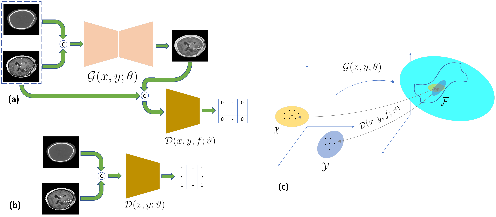

# MedFusionGAN: Multimodal Medical Image Fusion Using an Unsupervised Deep Generative Adversarial Network [PyTorch]

This study introduces a novel unsupervised generative model to fuse CT and three-dimensional contrast enhanced T1 of the patients with different brain tumor types. 


If this code helps with your research please consider citing the following paper:
</br>
> [M. Safari](https://scholar.google.com/citations?user=-G5yTDgAAAAJ&hl=en), [A. Fatemi](https://scholar.google.com/citations?hl=en&user=yYz5MZkAAAAJ), and [L. Archambault](https://scholar.google.com/citations?hl=en&user=PKYbYNIAAAAJ), "MedFusionGAN: Multimodal Medical Image Fusion Using an Unsupervised Deep Generative Adversarial Network", link [link](https://arxiv.org). 

```python
soon

```

#### Please consider starring us, if you found it useful. Thanks

## Updates

The trained model is available [here](https://drive.google.com/file/d/1DudAwDvzhmsF9jDAwAWRIt7zEggNm3-2/view?usp=share_link).

This code has been implemented in python language using Pytorch library and tested in ubuntu OS, though should be compatible with related environment. following Environement and Library needed to run the code:

- Python 3
- Pytorch 1.12.0


## Quick Overview



## Results
The performance of the MedFusionGAN was compared with seven state-of-the-art traditional and eight state-of-the-art deep learning models. In bellow, results of the proposed approach illustrated.


### Query
All implementations are done by Mojtaba Safari. For any query please contact us for more information.


